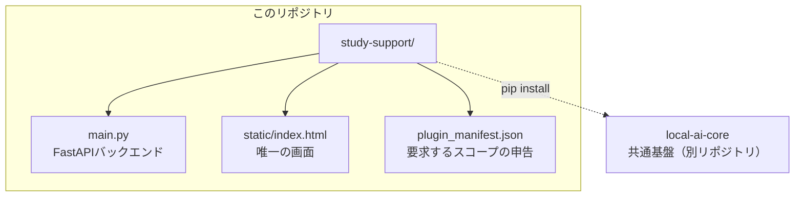

# study-support（学習支援）

「プライバシーファースト・ローカルAIエコシステム」の一部として動く、学習ログ記録アプリ。
科目・学習時間・理解度を記録するだけの最小実装だが、記録内容は共通基盤(`local_ai_core`)を
通じて他アプリとも安全に共有される。個人情報は端末内の SQLite にのみ保存され、
外部への送信は一切行わない。

このアプリ単体は Ollama 等の LLM を直接呼び出さない。理解度の低い科目の推測・
復習予定の共有といった「賢い」機能は、すべて共通基盤側のルールベース処理か、
gateway経由のオートメーション/アシスタントが担う。

---

## プロジェクト構成



「新しいアプリを追加する手順そのものを検証する」ステップ1として作られており、
`local_ai_core`が提供するパターン(memory書き込み・schedule書き込み・
権限が無くても本体機能は落とさない設計)以外の仕組みは意図的に増やしていない。

---

## 機能

- 学習ログの記録(科目・学習時間・理解度1〜5・メモ・復習日)
- **苦手分野の推測**: 理解度が低い(2以下)科目が2回以上記録されたら、
  `study.weak_subjects`として共通メモリーに自動反映(条件を満たさなくなれば自動的に消える)
- **復習予定の共有**: 復習日を指定すると、共通の予定表(`schedule_items`)にも登録される
- 教材ファイルの添付(`documents:write`)は今のところ未実装

---

## 動作要件

| 項目 | 内容 |
|------|------|
| OS | Windows / macOS / Linux(Docker利用時) |
| Python | 3.11以降 |
| Docker | docker-composeで他アプリと合わせて起動する場合に必要 |
| LLM / GPU | 不要(このアプリ単体はLLMを呼び出さない) |

---

## クイックスタート

### 開発者向け(ソースから単体起動)

```bash
pip install -r requirements.txt
pip install /path/to/local-ai-core   # 共通基盤を別途インストール
uvicorn main:app --port 8100
# → http://localhost:8100
```

### docker-composeの一部として起動(推奨)

umbrella repo(`life-support-os`)側の`docker-compose.yml`に定義済み。

```bash
cd life-support-os
docker compose up -d study_support
# → http://localhost:8100(単体アクセス)
# → http://localhost:3000 の gateway にログインした上で /api/study/* 経由でもアクセス可
```

---

## 権限(スコープ)

このエコシステムでは、アプリが使いたいデータへのアクセスは`plugin_manifest.json`で
申告し、gatewayの統合コンソール(「01 権限」)でユーザーが個別に許可するまで
実際にはアクセスできない。

| スコープ | 用途 |
|---|---|
| `schedule_items:read` | 他アプリの予定と重複しないよう復習予定を確認するため |
| `schedule_items:write` | 復習日を共通の予定表に登録するため |
| `memory:write:study.*` | 苦手分野の推測を他アプリと共有するため |
| `memory:read:study.*` | 過去の苦手分野を記録時の参考にするため |

いずれも未許可のままでもログ記録そのものは失敗しない。該当機能だけが静かに
スキップされ、`schedule_synced`が`false`で返る。

---

## エンドポイント

| メソッド | パス | 内容 |
|---|---|---|
| GET | `/` | 学習ログの記録・一覧画面 |
| GET | `/health` | ヘルスチェック(`{"ok": true, "profile_id": ...}`) |
| POST | `/logs` | ログを1件登録。`subject` `minutes` `understanding`(1〜5) `note` `review_date`(任意) |
| GET | `/logs` | 登録済みログの一覧(新しい順) |
| DELETE | `/logs/{id}` | ログを削除。復習予定があればあわせてキャンセル扱いにする |

---

## 共通仕様

| 項目 | 内容 |
|------|------|
| データ保存 | SQLite(ローカルのみ)。既定は`/app/data/study.db`(環境変数`STUDY_DB_PATH`で変更可) |
| 共通基盤 | `local_ai_core`の`core.db`(環境変数`LOCAL_AI_CORE_DB_PATH`。gateway等と必ず同じ値にすること) |
| 外部送信 | なし(このアプリ単体はネットワーク越しの外部通信を一切行わない) |

---

## トラブルシューティング

| 症状 | 対処法 |
|------|--------|
| 復習日を指定したのに共通予定表に反映されない(`schedule_synced: false`) | gatewayの統合コンソール「01 権限」で`study_support`の`schedule_items:write`が許可されているか確認してください |
| 苦手分野が反映されない | 同一科目で理解度2以下の記録が2件以上あるか、`memory:write:study.*`が許可されているか確認してください |
| `local_ai_core`が見つからない、とエラーが出る(単体起動時) | `pip install /path/to/local-ai-core`が実行済みか確認してください。docker-compose経由の場合はDockerfile内で自動的にインストールされます |

---

## 制約(現時点)

- 教材ファイルの添付(`documents:write`)は未実装
- 専用フロントエンドは`static/index.html`のみ。gateway側への埋め込みマウントは無く、
  直接ポート(8100)でアクセスする運用
- `study_logs`テーブルへのカラム追加は、PRAGMAベースの簡易マイグレーションで
  行っている(本格的なマイグレーション機構は`local_ai_core`側にのみ存在する)
